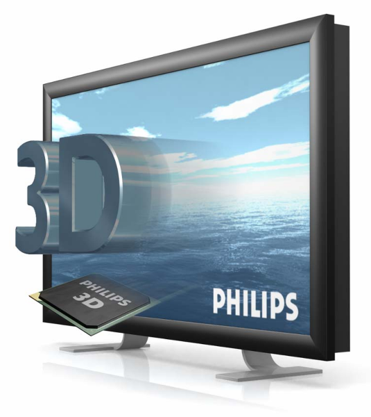
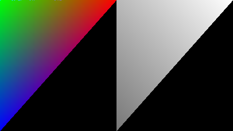
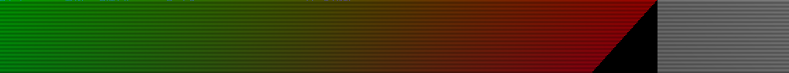
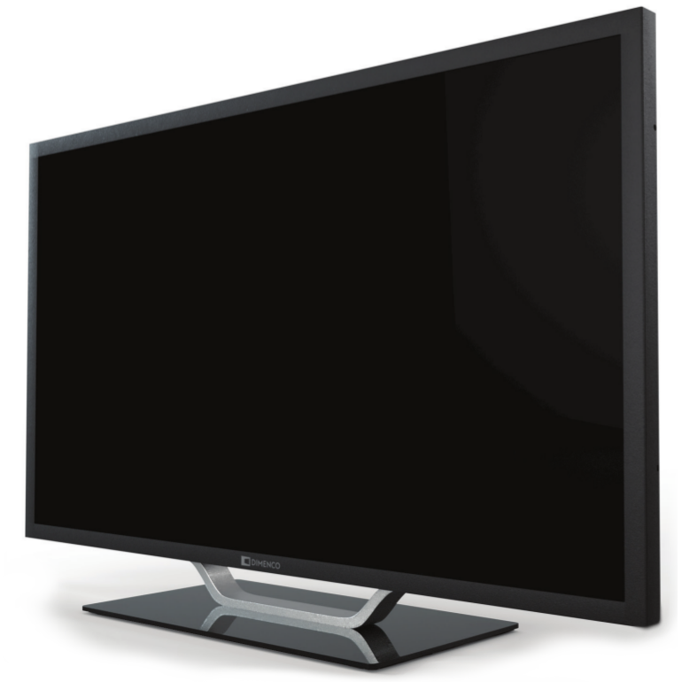
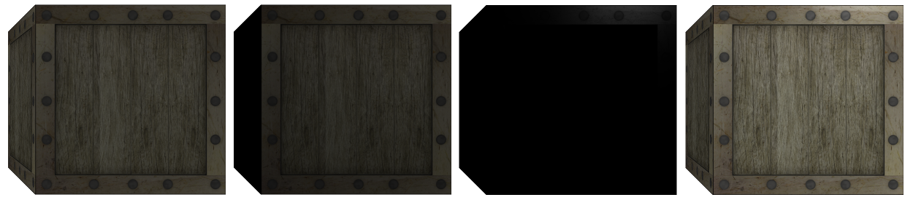
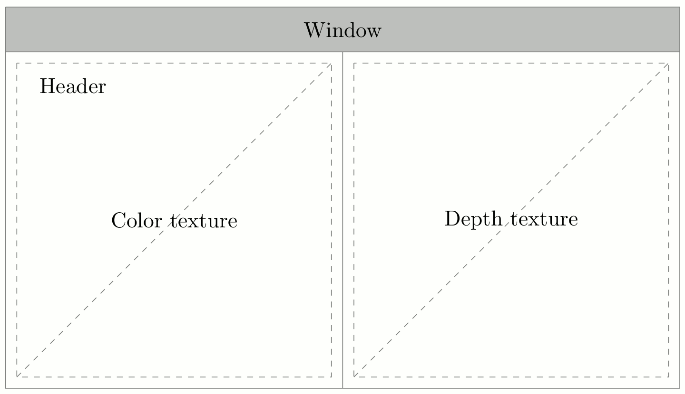
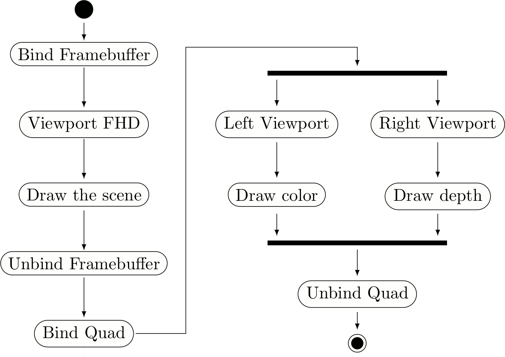
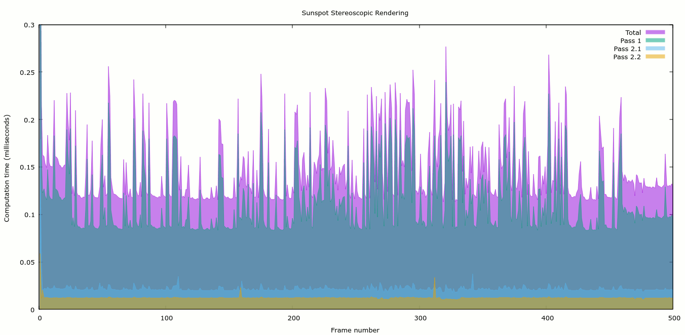
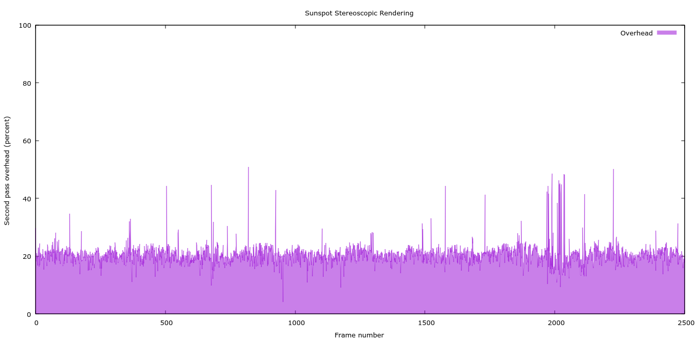
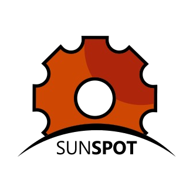

Tecniche di rendering stereoscopico
===================================
:author:    Antonio Caggiano
:email:     infoantoniocaggiano@gmail.com
:revdate:   10 Febbraio 2017
:revnumber: 0.2.0
:backend:   slidy
:max-width: 45em
:data-uri:
:icons:
:linkcss:
:stylesdir: css
:scriptsdir: js

Sommario
--------
[role="incremental"]
. 3DTV - monitor autostereoscopico che aggiunge profondità
. OpenGL - libreria grafica utilizzata
. Rendering stereoscopico - tecnica per la creazione del frame
. SunSpoT - applicazione dimostrativa

3DTV
----

[role="incremental"]
- Prodotto di prossima generazione
- Profondità senza occhiali 3D
- Tecnologia _lenticular lens_

Philips 3D Interface Specifications
-----------------------------------
https://www.vrlab.ctw.utwente.nl/eq/Documentation/3ddisplay_3DInterfaceWhitePaper.pdf[White Paper]

[role="incremental"]
- Formato del frame
[role="incremental"]
  * 2D-plus-Depth
  * Declipse

2D-plus-Depth
-------------

[role="incremental"]
- Header
- Color sub-image
- Depth sub-image

[role="incremental"]
.Dettaglio del frame

[role="incremental"]
.Dettaglio dell'header

Dimenco DM654MAS
----------------

[role="incremental"]
- 65” (165cm)
- QFHD (3840x2160) o UHD (4096x2160)
- 3D/2D mode

OpenGL
------
Generalmente, i contenuti per display autostereoscopici sono
generati attraverso tecniche di computer grafica, poiché le
informazioni sulla profondità sono facilmente ottenibili.

*OpenGL* è una rendering API cross-language e cross-platform.

È largamente utilizzata nei campi della _computer-aided design_,
 _realtà virtuale_, e nei _videogiochi_.

Utilizzo questa tecnologia per effettuare il _rendering stereoscopico_.

Rendering stereoscopico
-----------------------
Di cosa abbiamo bisogno?
[role="incremental"]
- Disegnare la scena per generare
  * color image
  * depth image 
[role="incremental"]
- Creare un frame 2D-plus-Depth
  * colore a sinistra
  * profondità a destra
  * header in alto

[role="incremental"]
IMPORTANT: Come possiamo generare un'immagine con il colore e una con la profondità?
[role="incremental"]
- Framebuffer Object
  * Color texture attachment
  * Depth texture attachment

Framebuffer
-----------
.Framebuffer attachments
image::images/framebuffer.png[width="80%",alt="Framebuffer"]

Disegnare nel Framebuffer
-------------------------
[source,cpp]
---------------------------------------------------------------------
Size frameSize{ 1920, 1080 }; // FHD
glEnable(GL_DEPTH_TEST);
glBindFramebuffer(GL_FRAMEBUFFER, fbo);
glViewport(0, 0, frameSize.width, frameSize.height);
/*
	Comandi di disegno ...
*/
glBindFramebuffer(GL_FRAMEBUFFER, 0);
---------------------------------------------------------------------

Phong Reflection Model
----------------------
.Ambient + Diffuse + Specular = Phong Reflection

[source,cpp]
---------------------------------------------------------------------
// GLSL code
// ...

struct Material {
	vec3 ambient;
	vec3 diffuse;
	vec3 specular;
	float shininess;
	sampler2D diffuseMap;
	sampler2D specularMap;
};

void main()
{
	// Influisce nella componente ambient e diffuse
	vec3 fragment = vec3(texture(material.diffuseMap, texCoords));

	vec3 ambient = light.ambient * material.ambient * fragment;

	vec3 lightDirection = normalize(light.position - position);
	float diffuseFactor = max(dot(normal, lightDirection), zero);
	vec3 diffuse = diffuseFactor * light.diffuse * material.diffuse * fragment;

	vec3 cameraDirection = normalize(camera.position - position);
	vec3 reflectDirection = reflect(-lightDirection, normal); 
	float specularFactor = pow(max(dot(cameraDirection, reflectDirection), zero),
			material.shininess);
	vec3 specular = specularFactor * light.specular * material.specular *
			vec3(texture(material.specularMap, texCoords));

	color = vec4(ambient + diffuse + specular, one);
}
---------------------------------------------------------------------

Passi di rendering
------------------
[role="incremental"]
. Disegna la scena nel framebuffer
[role="incremental"]
. Disegna il frame nel default framebuffer
  * Colore a sinistra
  * Profondità a destra
  * Header in alto

[role="incremental"]
IMPORTANT: Come possiamo disegnare due texture affiancate nel default framebuffer?
[role="incremental"]
- Un quad e due viewport!

Disegnare nel default framebuffer
---------------------------------
.Secondo passo

[source,cpp]
---------------------------------------------------------------------
Size windowSize{ 3840, 2160 }; // QFHL
glDisable(GL_DEPTH_TEST);
glBindVertexArray(quadVAO);
glViewport(0, 0, windowSize.width / 2, windowSize.height);
/*
	Disegna la color texture ...
*/
glViewport(windowSize.width / 2, 0, windowSize.width / 2, windowSize.height);
/*
	Disegna la depth texture ...
*/
glBindVertexArray(0);
---------------------------------------------------------------------

Disegnare la color texture e l'header
-------------------------------------
La texture dell'header ha _clamped to edge_ wrapping.

[source,c]
---------------------------------------------------------------------
// GLSL code
uniform sampler2D colorTexture;
uniform sampler2D headerTexture; // 960x2
uniform vec2 frameSize; // FHD

in vec2 texCoords;

out vec4 color;

void main()
{
	vec2 headerCoords = vec2(texCoords.x, texCoords.y * frameSize.y);
	vec2 header = texture(headerTexture, headerCoords);
	color = texture(colorTexture, texCoords);
	color.b = header.r != 1.0 ? header.b : color.b;
}
---------------------------------------------------------------------

Disegnare la depth texture
--------------------------
Il white paper della Philips contiene una sezione con una formula che
ci aiuta a trasformare un valore di profondità nel range [0,1] in una
_disparity_ nel range [0, 255] adatta al formato 2D-plus-Depth.

[source,c]
---------------------------------------------------------------------
// GLSL code
// ...

// Philips white paper formula
float disparity(float z)
{
	z = (z + 1.0f) / 2.0f;
	return (M * (1.0f - vz / (z - Zd + vz)) + C);
}

void main()
{
	color = texture(depthTexture, texCoords);
	color.r = color.g = color.b = disparity(color.r);
}
---------------------------------------------------------------------

Activity Diagram
----------------
.Activity diagram del rendering stereoscopico

Profiling
---------
.Profiling dei passi di rendering

Overhead
--------
.Overhead del rendering stereoscopico

SunSpoT
-------

Applicazione 3D scritta in C++

[role="incremental"]
- Open-source
- Cross-platform
- Obj loader
- Phong lighting model

[role="incremental"]
https://github.com/Fahien/sunspot[Fork it on GitHub!]
