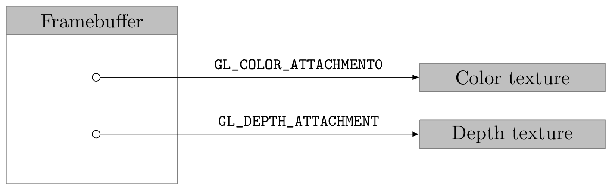

Stereoscopic Rendering
======================
:author:    Antonio Caggiano
:email:     infoantoniocaggiano@gmail.com
:revdate:   January 27, 2017
:revnumber: 0.1.0
:backend:   slidy
:max-width: 45em
:data-uri:
:icons:

Summary
--------
[role="incremental"]
. 3DTV
. OpenGL
. Stereoscopic Rendering
. SunSpoT

3DTV
----
image::images/3dtv.png[float="right"]

[role="incremental"]
- Next-generation product
- Depth without glasses
- Lenticular lens technology

Philips 3D Interface Specifications
-----------------------------------
https://www.vrlab.ctw.utwente.nl/eq/Documentation/3ddisplay_3DInterfaceWhitePaper.pdf[White Paper]

[role="incremental"]
- Data format
[role="incremental"]
  * 2D-plus-Depth
  * Declipse

2D-plus-Depth
-------------

[role="incremental"]
- Header
- Color sub-image
- Depth sub-image

[role="incremental"]
.Frame details

[role="incremental"]
.Header details

Dimenco DM654MAS
----------------
image::images/dimenco.png[float="right"]

[role="incremental"]
- 65” (165cm)
- QFHD (3840x2160)
- UHD (4096x2160)
- 3D/2D mode

OpenGL
------
In general, contents for stereoscopic displays are generated
by computer graphics tecniques, because depth
information can be easily obtained.

*OpenGL* is a cross-language, cross-platform rendering API.

Applications use it extensively in the fields of _computer-aided
design_, _virtual reality_, and _video games_.

I'm going to use it in order to achieve _stereoscopic rendering_.

Stereoscopic Rendering
----------------------
What do we need?
[role="incremental"]
- Draw the scene to generate
  * color image
  * depth image
[role="incremental"]
- Make a 2D-plus-Depth frame
  * color on the left
  * depth on the right
  * header on top

[role="incremental"]
IMPORTANT: How can we generate a color and a depth image?
[role="incremental"]
- Framebuffer Object
  * Color texture attachment
  * Depth texture attachment

Framebuffer
-----------
.Framebuffer attachments

[source,cpp]
---------------------------------------------------------------------
// Framebuffer size
Size size{ 1920, 1080 };

// Create a framebuffer object
GLuint fbo;
glGenFramebuffers(1, &fbo);
glBindFramebuffer(GL_FRAMEBUFFER, fbo);

// Create a texture for colors
GLuint colorTexture;
glGenTextures(1, &colorTexture);
glBindTexture(GL_TEXTURE_2D, colorTexture);
glTexImage2D(GL_TEXTURE_2D, 0, GL_RGB, size.width, size.height, 0, GL_RGB,
		GL_UNSIGNED_BYTE, nullptr);
glTexParameteri(GL_TEXTURE_2D, GL_TEXTURE_MIN_FILTER, GL_NEAREST);
glTexParameteri(GL_TEXTURE_2D, GL_TEXTURE_MAG_FILTER, GL_NEAREST);
glFramebufferTexture2D(GL_FRAMEBUFFER, GL_COLOR_ATTACHMENT0, GL_TEXTURE_2D,
		colorTexture, 0);

// Create a texture for depth
GLuint depthTexture;
glGenTextures(1, &depthTexture);
glBindTexture(GL_TEXTURE_2D, depthTexture);
glTexImage2D(GL_TEXTURE_2D, 0, GL_DEPTH_COMPONENT, size.width, size.height,
		0, GL_DEPTH_COMPONENT, GL_UNSIGNED_BYTE, nullptr);
glTexParameteri(GL_TEXTURE_2D, GL_TEXTURE_MIN_FILTER, GL_NEAREST);
glTexParameteri(GL_TEXTURE_2D, GL_TEXTURE_MAG_FILTER, GL_NEAREST);
glFramebufferTexture2D(GL_FRAMEBUFFER, GL_DEPTH_ATTACHMENT, GL_TEXTURE_2D,
		depthTexture, 0);

if (glCheckFramebufferStatus(GL_FRAMEBUFFER) == GL_FRAMEBUFFER_COMPLETE) {
	std::cout << "Framebuffer created\n";
	glBindFramebuffer(GL_FRAMEBUFFER, 0);
}
else {
	glDeleteTextures(1, &depthTexture);
	glDeleteTextures(1, &colorTexture);
	glDeleteFramebuffers(1, &fbo);
	glBindFramebuffer(GL_FRAMEBUFFER, 0);
	throw FramebufferException{ "Creation failed" };
}
---------------------------------------------------------------------

Draw on the Framebuffer
-----------------------
[source,cpp]
---------------------------------------------------------------------
glEnable(GL_DEPTH_TEST);
glBindFramebuffer(GL_FRAMEBUFFER, fbo);
glViewport(0, 0, size.width, size.height);
/*
	Drawing commands ...
*/
glBindFramebuffer(GL_FRAMEBUFFER, 0);
---------------------------------------------------------------------

Phong Reflection Model
----------------------
.Ambient + Diffuse + Specular = Phong Reflection

[source,cpp]
---------------------------------------------------------------------
// GLSL code
const float zero = 0.0f;
const float one = 1.0f;

struct Material {
	vec3 ambient;
	vec3 diffuse;
	vec3 specular;
	float shininess;
	sampler2D diffuseMap;
	sampler2D specularMap;
};

struct Light {
	vec3 position;
	vec3 ambient;
	vec3 diffuse;
	vec3 specular;
};

struct Camera {
	vec3 position;
};

uniform Light light;
uniform Camera camera;
uniform Material material;

in vec3 position;
in vec3 normal;
in vec2 texCoords;

out vec4 color;

void main()
{
	vec3 fragment = vec3(texture(material.diffuseMap, texCoords));

	vec3 ambient = light.ambient * material.ambient * fragment;

	vec3 lightDirection = normalize(light.position - position);
	float diffuseFactor = max(dot(normal, lightDirection), zero);
	vec3 diffuse = diffuseFactor * light.diffuse * material.diffuse * fragment;

	vec3 cameraDirection = normalize(camera.position - position);
	vec3 reflectDirection = reflect(-lightDirection, normal); 
	float specularFactor = pow(max(dot(cameraDirection, reflectDirection), zero),
			material.shininess);
	vec3 specular = specularFactor * light.specular * material.specular *
			vec3(texture(material.specularMap, texCoords));

	color = vec4(ambient + diffuse + specular, one);
}
---------------------------------------------------------------------

Render Passes
-------------
[role="incremental"]
. Draw the scene on the framebuffer
[role="incremental"]
. Draw the frame on the default framebuffer
  * Color on the left
  * Depth on the right
  * Header on top

[role="incremental"]
IMPORTANT: How do we draw a texture on the default framebuffer?
[role="incremental"]
- A quad and two viewports!

Quad
----
[source,cpp]
---------------------------------------------------------------------
GLuint quadVBO; // Generate a vertex buffer object
glGenBuffers(1, &quadVBO);

GLuint quadEBO; // Generate a element buffer object
glGenBuffers(1, &quadEBO);

GLuint quadVAO; // Generate a vertex array object
glGenVertexArrays(1, &quadVAO);
glBindVertexArray(quadVAO);

// Copy the vertices in the buffer
glBindBuffer(GL_ARRAY_BUFFER, quadVBO);
GLfloat vertices[] = {
	// Positions  // TexCoords
	-1.0f, -1.0f, 0.0, 0.0, // Bottom left
	 1.0f, -1.0f, 1.0, 0.0, // Bottom right
	 1.0f,  1.0f, 1.0, 1.0, // Top right
	-1.0f,  1.0f, 0.0, 1.0  // Top left
};
glBufferData(GL_ARRAY_BUFFER, sizeof vertices, vertices, GL_STATIC_DRAW);

// Copy the indices in the buffer
glBindBuffer(GL_ELEMENT_ARRAY_BUFFER, quadEBO);
GLuint indices[] = {
	0, 1, 2,
	0, 2, 3
};
glBufferData(GL_ELEMENT_ARRAY_BUFFER, sizeof indices, indices, GL_STATIC_DRAW);

// Specify the vertex shader input in the form of vertex attributes
glVertexAttribPointer(0, 2, GL_FLOAT, GL_FALSE, 4 * sizeof(GLfloat),
		(GLvoid *)0);
glEnableVertexAttribArray(0);
glVertexAttribPointer(1, 2, GL_FLOAT, GL_FALSE, 4 * sizeof(GLfloat),
		(GLvoid *)(2 * sizeof(GLfloat)));
glEnableVertexAttribArray(1);

glBindVertexArray(0);
---------------------------------------------------------------------

Draw on the default framebuffer
-------------------------------
.Second pass
image::images/viewports.png[width="80%",alt="Second pass"]

[source,cpp]
---------------------------------------------------------------------
Size windowSize{ 3840, 2160 };
glDisable(GL_DEPTH_TEST);
glBindVertexArray(quadVAO);
glViewport(0, 0, windowSize.width / 2, windowSize.height);
/*
	Draw the color texture ...
*/
glViewport(windowSize.width / 2, 0, windowSize.width / 2, windowSize.height);
/*
	Draw the depth texture ...
*/
glBindVertexArray(0);
---------------------------------------------------------------------

Draw the color texture and the header
-------------------------------------
The header texture will be _clamped to edge_.
[source,c]
---------------------------------------------------------------------
// GLSL code
uniform sampler2D colorTexture;
uniform sampler2D headerTexture;
uniform vec2 frameSize;

in vec2 texCoords;

out vec4 color;

void main()
{
	vec2 headerCoords = vec2(texCoords.x, texCoords.y * frameSize.y);
	vec2 header = texture(headerTexture, headerCoords);
	color = texture(colorTexture, texCoords);
	color.b = header.r != 1.0 ? header.b : color.b;
}
---------------------------------------------------------------------

Draw the depth texture
----------------------
The Philips white paper contains a section with a formula which helps
us to translate a depth value within the [0,1] range into a [0, 255]
_disparity_ suitable for the 2D-plus-Depth format.

[source,c]
---------------------------------------------------------------------
// GLSL code

// Philips white paper constants
const float Zd = 0.467481; // Display pane depth
const float vz = 7.655192; // View distance in coordinate units
const float M = -1960.37; // Linear function multiplier
const float C = 127.5; // Linear function constant

uniform sampler2D depthTexture;

in vec2 texCoords;

out vec4 color;

// Philips white paper formula
float disparity(float z)
{
	z = (z + 1.0f) / 2.0f;
	return (M * (1.0f - vz / (z - Zd + vz)) + C);
}

void main()
{
	color = texture(depthTexture, texCoords);
	color.r = color.g = color.b = disparity(color.r);
}
---------------------------------------------------------------------

Activity Diagram
----------------
.Stereoscopic rendering activity diagram
image::images/diagram.png[width="75%",alt="Activity Diagram"]

Profiling
---------
.Profile stereoscopic rendering
image::images/profiling.png[]

Overhead
--------
.Stereoscopic rendering overhead

SunSpoT
-------

3D engine written in C++

[role="incremental"]
- Open-source
- Cross-platform
- Obj loader
- Phong lighting model

[role="incremental"]
https://github.com/Fahien/sunspot[Fork it on GitHub!]
